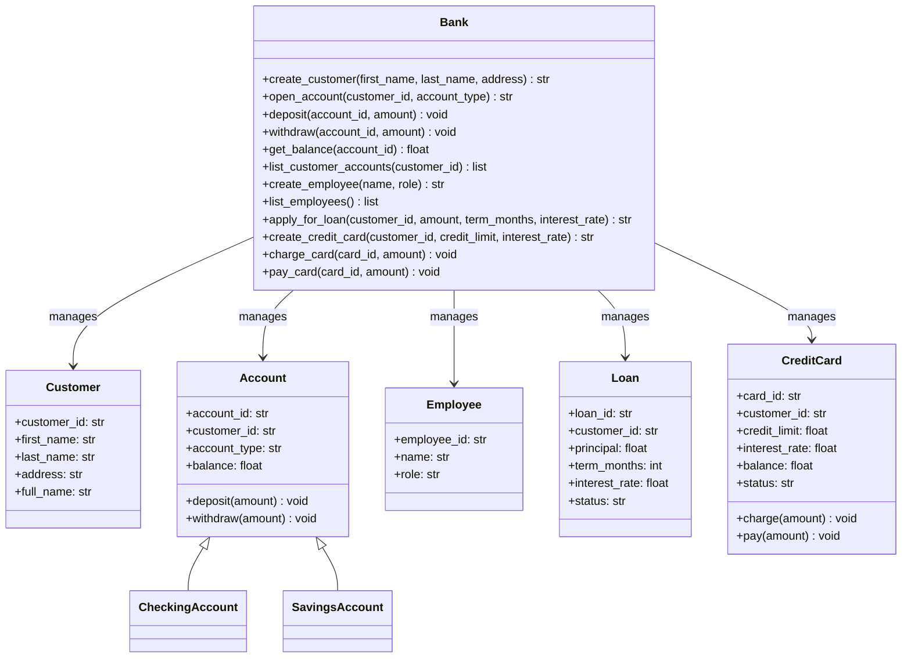

# UML Class Diagram for Banking System spring board oop project

This UML class diagram documents the banking system design including classes key fields
key methods and relationships, associations and inheritance

